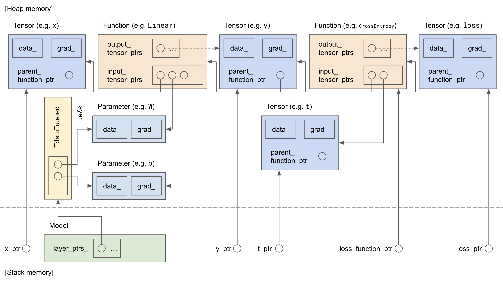

[](https://github.com/hotsuyuki/tensorward/actions/workflows/test.yml)

# tensorward

A minimalist deep learning framework with Define-by-Run schema written in C++

* [Project purpose](#project-purpose)
* [Architecture overview](#architecture-overview)
* [Example code](#example-code)
* [Future work](#future-work)

## Project purpose

This is a build-it-yourself project for learning about the internal concepts underlying deep learning framework with C++. 
The only external dependency of this project is [xtensor](https://github.com/xtensor-stack/xtensor), a NumPy-like library for C++ (other than non-essential ones such as [curl](https://github.com/curl/curl/) and [gzip-hpp](https://github.com/mapbox/gzip-hpp/)).

The only prerequisite to build and run this project is:

* [Bazel](https://github.com/bazelbuild/bazel) (or [Bazelisk](https://github.com/bazelbuild/bazelisk) for convenience)

That's it. All of the external dependencies needed for this project will be installed automatically when building by Bazel.

## Architecture overview

The figure below shows the relationship between each class when we run a model that is composed of a single linear layer and use cross entropy error as a loss function.



Basically the process flow is like: a `Tensor` is inputted to a `Function` and it outputs a new `Tensor`, and the outputted `Tensor` is then inputted to another `Function` and it outputs another new `Tensor` ... and so on.
It flows in *forward* direction.
However the relationship between each `Tensor` and `Function` is connected in *backward* direction, and this backward connection is established when each `Function` executes its forward calculation.
This enables automatic gradient through backpropagation with Define-by-Run schema.

To implement the Define-by-Run schema by imitating Python memory management, C++ shared pointer is chosen as the key ingredient of this project (Circles with a solid/dashed arrow in the figure above denote shared/weak pointer).
For more details about the similarity between C++ shared pointer and Python memory management, see this page: [Memory management in C++ and Python](https://doc.nektar.info/developerguide/latest/developer-guidese58.html)

## Example code

An example usage of this project would be like this:

```C++
namespace tw = tensorward::core;
namespace F = tensorward::function;
namespace M = tensorward::model;
namespace O = tensorward::optimizer;

int main(int argc, char* argv[]) {

  /* Some pre-process code ... */

  // Model
  M::MultiLayerPerceptron model({kHiddenSize, kHiddenSize, kOutSize}, tw::AsFunctionSharedPtr<F::ReLU>());

  // Optimizer
  O::StochasticGradientDescent optimizer(kLearningRate);

  for (std::size_t epoch = 0; epoch < kMaxEpoch; ++epoch) {
    //// Train ////
    for (std::size_t i = 0; i < train_data_loader.max_iteration(); ++i) {
      // Batch data and label
      const auto [batch_x, batch_t] = train_data_loader.GetBatchAt(i);
      const tw::TensorSharedPtr batch_x_ptr = tw::AsTensorSharedPtr(batch_x, "batch_x");
      const tw::TensorSharedPtr batch_t_ptr = tw::AsTensorSharedPtr(batch_t, "batch_t");

      // Prediction
      const tw::TensorSharedPtr batch_y_pred_ptr = model.Predict({batch_x_ptr})[0];

      // Loss
      const tw::TensorSharedPtr batch_loss_ptr = F::softmax_cross_entropy_error(batch_y_pred_ptr, batch_t_ptr);

      // Backpropagation
      model.ClearGrads();
      batch_loss_ptr->Backpropagation();

      // Parameter update
      optimizer.Update(model.GetParamPtrs());
    }
  }

  /* Some post-process code ... */

  return EXIT_SUCCESS;
}
```

This repository contains an example code for MNIST classification [here](./example/6_classification_mnist_dataset/main.cc).
It can be run by:

```
$ bazel run //example/6_classification_mnist_dataset:main
```

and the result would look like below.
The loss decreases as epoch iterates and the accuracy after 5 epochs is more than 85%.

```
Train...
Test...
epoch = 0
average_train_loss = 1.68154
average_test_loss = 0.992631
average_train_accuracy = 0.580667
average_test_accuracy = 0.782

Train...
Test...
epoch = 1
average_train_loss = 0.75271
average_test_loss = 0.597104
average_train_accuracy = 0.823333
average_test_accuracy = 0.843

Train...
Test...
epoch = 2
average_train_loss = 0.538268
average_test_loss = 0.496765
average_train_accuracy = 0.8595
average_test_accuracy = 0.858

Train...
Test...
epoch = 3
average_train_loss = 0.45299
average_test_loss = 0.45914
average_train_accuracy = 0.878333
average_test_accuracy = 0.862

Train...
Test...
epoch = 4
average_train_loss = 0.407395
average_test_loss = 0.42503
average_train_accuracy = 0.8885
average_test_accuracy = 0.869

------------------------------------

average_train_losses = [1.68154, 0.75271, 0.538268, 0.45299, 0.407395, ]
average_test_losses = [0.992631, 0.597104, 0.496765, 0.45914, 0.42503, ]

------------------------------------

average_train_accuracies = [0.580667, 0.823333, 0.8595, 0.878333, 0.8885, ]
average_test_accuracies = [0.782, 0.843, 0.858, 0.862, 0.869, ]
```

## Future work
- [ ] Add wrapper classes for `tw::XxxSharedPtr` classes for usability
- [ ] Add more layers such as Dropout, Convolution, Recurrent, etc.
- [ ] Support Graphviz to visualize computational graphs
- [ ] Support GPU acceleration
